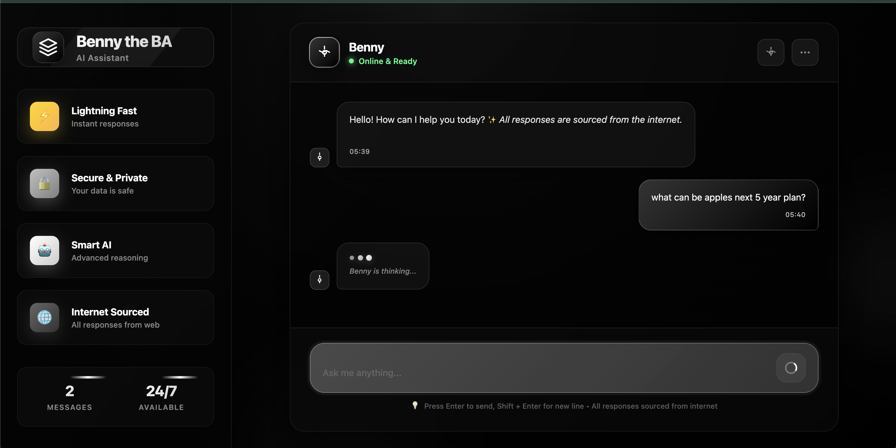
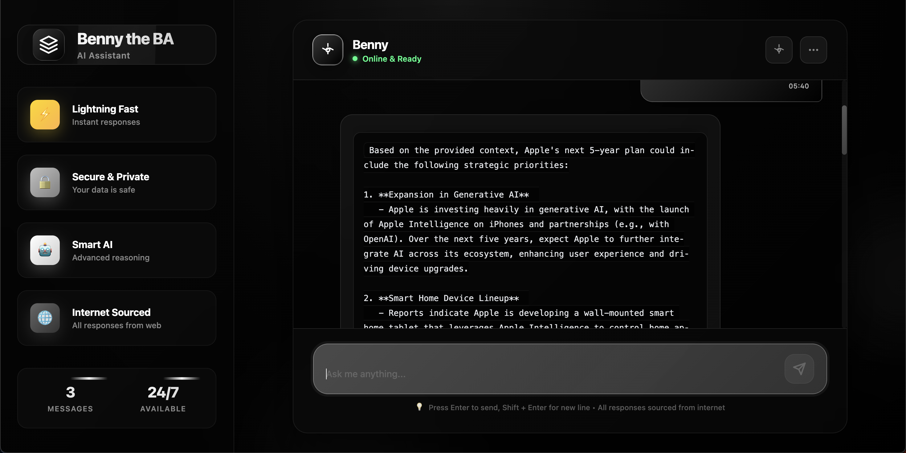
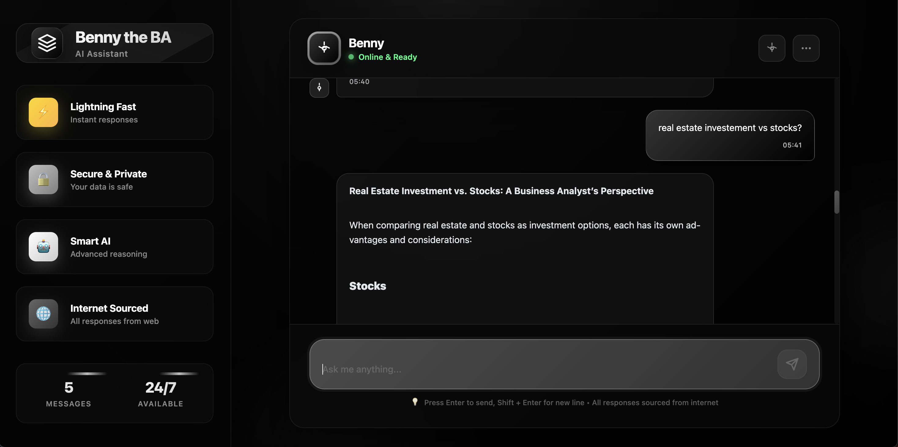
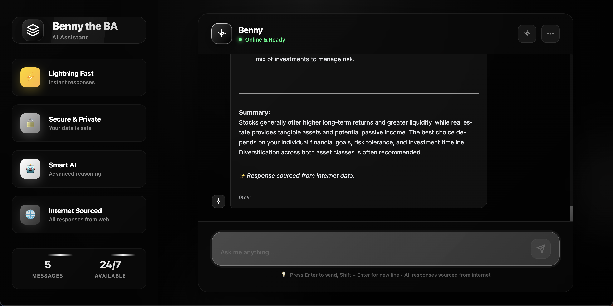

# 🧠 Benny — The Business Analyst Chatbot

**Benny** is an AI-powered chatbot that acts like a Business Analyst. It smartly interprets user queries, searches the web for relevant information (e.g., articles, reports, Wikipedia pages), and responds with precise, contextual answers using RAG (Retrieval-Augmented Generation).



---

## 🚀 Features

- 🔍 Extracts key topics from user queries
- 🌐 Searches the web using SerpAPI (Google Search API)
- 📄 Loads external web pages via WebBaseLoader
- 🧩 Splits content into meaningful chunks
- 🧠 Embeds data using OpenAI/Azure embeddings
- 🧬 Stores & retrieves documents from **ChromaDB**
- 💬 Responds using RAG pipeline with LangChain



---

## 🛠 Tech Stack

| Layer        | Tools Used                                      |
|--------------|-------------------------------------------------|
| Frontend     | SvelteKit                                       |
| Backend      | FastAPI                                         |
| AI / NLP     | LangChain, Azure OpenAI / OpenAI                |
| Search       | SerpAPI (Google Search), Wikipedia              |
| Loader       | WebBaseLoader (LangChain)                       |
| Vector DB    | ChromaDB                                        |
| Containerization | Docker (Python 3.13 for backend)            |

---

## 📦 Project Structure

```bash
.
├── frontend/              # SvelteKit frontend (runs on port 5173)
├── backend/               # FastAPI backend (runs on port 8000)
│   ├── main.py            # API entry point
│   ├── rag_pipeline.py    # Web scraping, embedding, RAG logic
│   ├── requirements.txt
│   └── Dockerfile
└── README.md
```

Here’s a clean and well-structured version of your markdown instructions for **🐳 Running Locally (Dev)**:

---

## 🐳 Running Locally (Dev)

### 1. Clone the Repo

```bash
git clone https://github.com/yourusername/benny-chatbot.git
cd benny-chatbot
```

### 2. Backend (FastAPI)

Using `pip`

```bash
cd backend
pip install -r requirements.txt
uvicorn main:app --reload --port 8000
```

### Or using Docker

```bash
cd backend
docker build -t benny-backend -f Dockerfile .
docker run -p 8000:8000 benny-backend
```

### 3. Frontend (SvelteKit)

```bash
cd ../frontend
npm install
npm run dev -- --host
```

🔗 Open in your browser: [http://localhost:5173](http://localhost:5173)

---




## 💡 How It Works

-User asks a question, e.g. "What is the future of fintech in India?"

-LLM extracts the main topic → fintech in India

--Searches Google using SerpAPI and gets the most relevant link

-Downloads content using WebBaseLoader

-Chunks and embeds the text using Azure OpenAI

-Stores in ChromaDB

-RAG pipeline retrieves relevant chunks and passes them to GPT-4

-Benny replies with a smart, contextual answer

-📘 Example Query
-"What can be Apple's target in next 5 years"

→ Benny extracts "Apples Plan", fetches the article, chunks and embeds it, and finally answers the question with context-aware information.

---

## 🔐 Environment Variables

```bash
Create a .env in your backend root:
env
Copy
Edit
AZURE_OPENAI_KEY=your_openai_key
AZURE_OPENAI_ENDPOINT=https://your-azure-endpoint
AZURE_DEPLOYMENT_NAME=gpt-4.1
SERPAPI_API_KEY=your_serpapi_key
```

---

## Future Improvements

-Persistent memory with Redis or Supabase

-Rich UI support (tables, graphs, etc.)

-User login and chat history

-Multi-source search (YouTube, news, PDFs, etc.)

